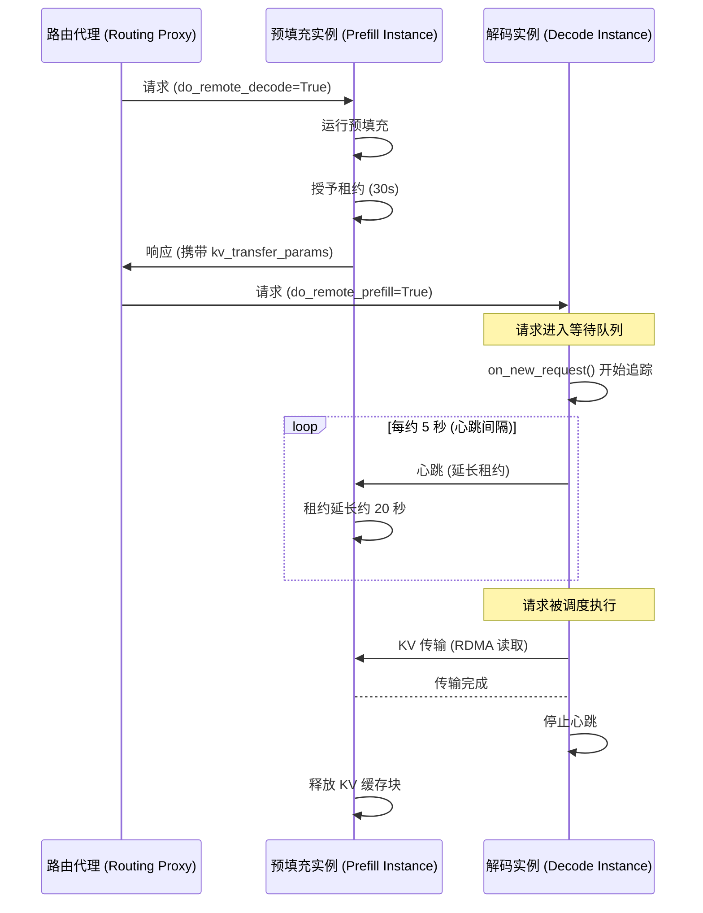
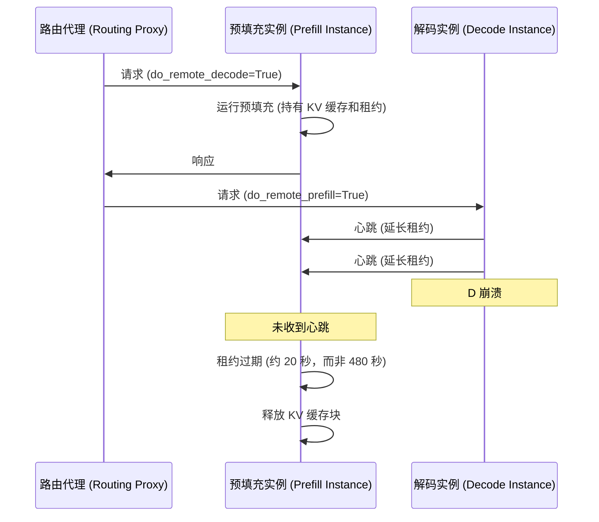

# NIXL KV 缓存租约续期 (NIXL KV Cache Lease Renewal)

在解耦预填充/解码（Disaggregated Prefill/Decode）部署中，Prefill（预填充）实例（P）在完成预填充后，必须将 KV 缓存块保留在 GPU 内存中，等待 Decode（解码）实例（D）通过 RDMA 读取它们。当 D 无法检索这些块时，需要一种机制来确定何时可以安全地释放它们。该机制在 [PR #41383](https://github.com/vllm-project/vllm/pull/41383) 中被引入。

## 动因 (Motivation)

### 单一超时时间的问题

最初的设计使用一个单一且较长的超时时间（`VLLM_NIXL_ABORT_REQUEST_TIMEOUT`，默认 480 秒）来控制 P 保留 KV 块的时长。当 D 崩溃或断开连接时，P 将持有数 GB 的“失效”缓存块长达 8 分钟，然后才能将其回收。在此窗口期间，发送到 P 的后续请求会面临缓存容量减少、性能下降的问题。

### 系统过载的问题

如果仅是简单地降低超时时间，会引入另一种失效模式。在流量激增时，请求可能会在 D 的等待队列中积压很长时间才能被调度。如果 P 上的固定超时时间设置得太短，缓存块在 D 有机会读取之前就会被释放 —— 这将导致不必要的重复计算和预填充工作的浪费。

### 解决方案：基于心跳的租约续期

租约续期机制同时解决了这两个问题。在预填充完成时，P 授予一个**较短的初始租约**（默认 30 秒）。当请求在 D 上**排队或处于处理中（in-flight）**时，D 会**定期向 P 发送心跳**以延长租约。如果 D 崩溃并停止发送心跳，P 会在最后一次心跳后的几秒钟内回收缓存块，而不是等待数分钟。如果 D 仅仅是处于过载状态，心跳可以根据需要一直维持缓存块的存活。

## 工作原理

### 租约生命周期

当 P 完成预填充时，它会为 KV 缓存块绑定一个初始租约时长（`kv_lease_duration`，默认 30 秒）。从这一刻起，这些缓存块将被保留，直到发生以下情况之一：

1. **D 完成了 KV 传输** —— P 收到读取完成通知并立即释放缓存块。
2. **D 持续发送心跳** —— 每次心跳将租约延长 `lease_duration * 2/3`（约 20 秒），在 D 正常工作期间无限期保持缓存块存活。
3. **未收到心跳** —— 租约过期，P 回收这些缓存块。

### 捎带在 NIXL 通知上 (Piggybacking on NIXL notifications)

心跳复用了 NIXL 现有的通知系统（`send_notif` / `get_new_notifs`），而不是引入新的传输通道。通知介质是特定于后端的，NIXL 已经处理了从 IB/RoCE 自动回退到 TCP 的逻辑。D 向特定 P 发送的每一次心跳消息，都会代表该 D 续期所有在 P 中固定的请求 —— 换句话说，每个迭代的单个批处理消息可以续期多个请求的租约。

### 调度器端的追踪 (D)

一个关键的洞察是，心跳必须**在请求进入 D 的调度器时立即开始** —— 而不是在其被调度执行时才开始。在重载下，请求在等待队列中停留的时间可能远超初始租约时长，且到达与调度之间的时间间隔是无界的。

为此，D 的连接器（`NixlConnectorScheduler`）通过 `on_new_request()` 挂钩到调度器中。当携带 `do_remote_prefill=True` 的请求到达时，连接器立即开始为该请求追踪心跳。为了高效地进行批处理，请求按 `remote_engine_id` 分组。在每个调度器步骤中，心跳元数据被打包进 `NixlConnectorMetadata` 并发送给工作进程，心跳间隔受到 `lease_duration // 6`（约 5 秒）的流控限制。

当 KV 传输完成（通过 `update_connector_output`）或请求结束/中止（通过 `request_finished`）时，追踪将停止。

### 定时与简易性

心跳的发送和处理发生在**前向传播循环中**，而不是在后台线程中。这意味着定时不是毫秒级精确的 —— 较长的模型前向传播会延迟心跳。然而，租约时长配置了足够的裕量：在默认设置下，心跳间隔（约 5 秒）和租约延长量（约 20 秒）比典型的模型前向传播时间至少大一个数量级。这避免了线程之间的锁复杂性，同时保持了设计的简单与可扩展性。

## 正常流程 (Happy Path)



## 解码实例崩溃流程 (Decode Instance Crash)



### 工作进程侧的发送与接收

**在 D 上（发送）：** 在 `start_load_kv()`（每个前向传播步中调用）期间，工作进程读取 `metadata.heartbeat_by_engine` 并将批处理心跳通知发送到每个远程 P 引擎。如果 D 尚未与给定的 P 引擎建立握手（这在请求仍在等待队列中时很常见），它会在后台线程中触发一次**主动握手**。
一旦握手完成，心跳将被推迟到下一步发送 —— 提前握手也有助于**加速最终的 KV 传输。**

**在 P 上（接收）：** 在 `_get_new_notifs()` 中，P 的工作进程检查传入的 NIXL 通知。以 `"HB:"` 开头的消息会被路由到 `_handle_heartbeat()`，它使用 `max(old_expiry, now + lease_extension)` 来延长每个被引用请求的租约过期时间。这确保了租约绝不会被意外缩短。

## 双向 KV 传输 (Bidirectional KV Transfer)

对于多轮对话，[双向 KV 传输](../features/disagg_prefill.md) 允许 D 缓存 KV 块，以便 P 在后续轮次中拉取。由于下一轮对话的时机是**由客户端决定**的（而非由系统控制），因此基于心跳的租约机制在此处并不适用。相反，一个单独的 `decoder_kv_blocks_ttl`（默认 480 秒）为缓存于 D 上的数据块提供了一个简单的固定超时。如果客户端花费太长时间才继续对话，这些缓存块就会过期，P 将重新进行计算。未来的工作可能会将对称的心跳机制扩展到这种情况。

## 关键设计决策

- **基于请求的租约，而非基于实例。** P 无法感知其 KV 块属于哪个 D —— 块的所有权只有在预填充完成且路由器选择了 D 之后才能确定。基于请求级别的租约设计，避免了在负载均衡器中强行耦合 P/D 选择。在实践中，D 通过将具有相同 `remote_engine_id` 的请求分组，来向同一个 P 批量发送租约延长。

- **使用 NIXL 通知作为传输媒介。** 心跳复用了现有的 `send_notif` / `get_new_notifs` 系统，而没有增加 ZMQ 连接或修改 API。通知介质是特定于后端的，IB/RoCE 到 TCP 的回退逻辑已在底层被处理，这使得心跳可以在任何 NIXL 支持的传输层工作。

- **无后台线程。** 心跳的发送和处理发生在前向传播循环中（`start_load_kv` / `get_finished`）。这避免了线程之间的锁复杂性。相对于前向传播的延迟，租约时长留出了足够的裕量（秒级对毫秒级）。

- **主动握手。** 当 D 需要向尚未建立连接的 P 引擎发送心跳时（这在请求仍在等待队列中时很常见），它会在后台线程中触发一次早期握手。这也加快了最终 KV 传输的速度。

- **异构 TP 支持。** 当 P TP > D TP（例如，P TP=4, D TP=2）时，单个 D 工作进程要从多个 P 工作进程拉取数据。心跳必须发送到给定引擎的所有 P 工作进程。反之，当 D TP > P TP 时，单个 P 接收来自多个 D 的通知，这仅会多次刷新 TTL，没有任何副作用。

## 配置参数

租约机制是通过 `--kv-transfer-config` 中的 `kv_connector_extra_config` 控制的：

| 参数 | 默认值 | 描述 |
|-------------------------|---------|---------------------------------------------------------------------------------------------------------------------------------------------------------------|
| `kv_lease_duration`     | 30s     | P 上的初始租约时长。心跳间隔和延长量是自动派生的（`interval = duration // 6`，`extension = duration * 2 // 3`）。 |
| `decoder_kv_blocks_ttl` | 480s    | 双向传输模式下缓存于 D 上的 KV 缓存块的生存时间（TTL）。使用简单的固定超时，无法通过心跳刷新。 |

```bash
vllm serve <MODEL> \
  --kv-transfer-config '{
    "kv_connector": "NixlConnector",
    "kv_role": "kv_producer",
    "kv_connector_extra_config": {"kv_lease_duration": 60}
  }'
```

关于完整的 NixlConnector 配置细节，请参阅 [NixlConnector 使用指南](../features/nixl_connector_usage.md)。
