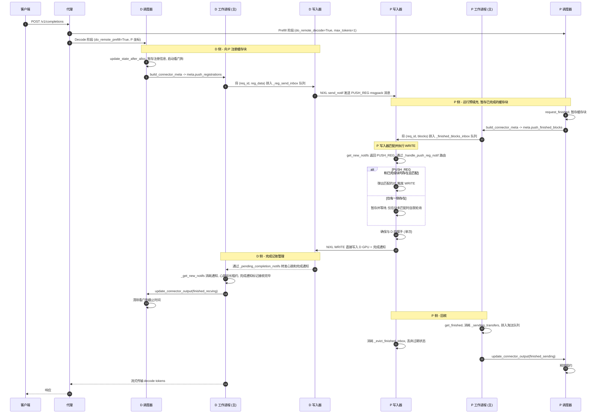

# NIXL 推送模式 KV 传输 (NIXL push-mode KV transfer)

默认的 NIXL 连接器是**基于拉取（Pull-based）**的：在预填充（Prefill）完成后，解码（Decode, D）实例通过 `NIXL READ` 从预填充（Prefill, P）实例中读取 KV 缓存块。`NixlPushConnector` 增加了一种**基于推送（Push-based）**的替代方案，其中 P 直接通过 `NIXL WRITE` 将 KV 缓存块写入 D 的预分配内存中。

本文档描述了特定于推送设计的线程、队列和调度交互。拉取模式的设计保持不变；推送连接器在可能的情况下复用了相同的握手、NIXL 代理设置和元数据路径。

## 高层流程 (High-level flow)



## 线程设计 (Threads)

`NixlPushConnectorWorker` 为每个工作进程（即每个 TP Rank）引入了一个专用的后台线程，命名为 `nixl-push-writer`。
每个线程在其 Rank 上拥有新的推送特定 NIXL 操作：

* `nixl_wrapper.get_new_notifs()` — 接收通知。
* `nixl_wrapper.send_notif(...)` — 用于发送 `PUSH_REG:<msgpack>` 消息（D 侧）和每次 WRITE 完成后的完成通知（P 侧）。
* `nixl_wrapper.make_prepped_xfer(...) / transfer(...)` — 提交 WRITE 操作本身。

心跳继续通过 `start_load_kv` 内部现有的基础工作进程 `_send_heartbeats` 管道从引擎主线程发出。

### 唤醒模型 (Wake model)

当写入器线程没有工作时，它会阻塞在 `_push_writer_wake`（一个 `threading.Event` 对象）上。有三个调用方会设置该事件：

1. **`start_load_kv`**（工作进程主线程，每个引擎步骤中配合调度器的元数据调用一次）— 仅在当前步骤确实向写入器递交了新工作（即 `meta.push_registrations` 或 `meta.push_finished_blocks` 非空）时设置该唤醒事件。这是对新传输的唤醒。
2. **`get_finished`**（工作进程主线程，每个引擎步骤中调用以报告完成情况）— 总是设置该唤醒事件。写入器是推送模式下 `nixl_wrapper.get_new_notifs()` 的唯一消费者，因此即使没有新的元数据需要处理，这也会给它一个消耗入站通知（来自 D 的心跳、WRITE 之后的完成通知、延迟到达的 `PUSH_REG`）的机会。
3. **握手完成回调**（后台握手执行器线程）— 当一个推迟的 D→P 握手成功结束时，Future 的 done-callback 会将注册信息重新排入 `_reg_send_inbox` 队列并设置该唤醒事件，以便对应的 `send_notif` 在写入器上运行（我们绝不从执行器线程调用 `send_notif`）。在第二次运行时，`_ensure_handshake` 将返回 `None`（因为代理现已连接），所以写入器直接发送 `PUSH_REG`。如果握手*失败*，回调会使请求失败，而不是重新排队，因此不存在重试循环。

除了事件驱动的唤醒之外，当存在 P 侧已完成块等待未匹配的 `PUSH_REG` 时，写入器会以 `_PUSH_WRITER_POLL_INTERVAL_MS = 1.0` 毫秒的间隔进行自我轮询。

当请求在 P 上完成（租约过期或 WRITE 结束）时，`get_finished` 会将请求 ID 排入 `_evict_finished_inbox`。写入器消耗该收件箱以丢弃过期的 `_push_finished_blocks` / `_pending_d_registrations` 并停止自我轮询。

## 写入器本地匹配表 (Writer-local matching tables)

| 数据表 | 拥有者 | 持有的内容 |
|--------------------------------|------------------|------------------------------------------------------------------------|
| `_pending_d_registrations`     | 写入器 | 从远程 D 接收到的 D 注册信息，正在等待 P 侧缓存块完成 |
| `_push_finished_blocks`        | 写入器 | 由调度器暂存的 P 侧块，正在等待远程 D 注册信息 |

任意一方都有可能先到达。写入器双向进行匹配：当 `PUSH_REG` 到达时，我们查找 `_push_finished_blocks`；当已完成块到达时，我们查找 `_pending_d_registrations`。
两边的查找都会首先尝试完全匹配 `request_id`，如果失败则回退到在剥离了各引擎特有的随机后缀（通过 `get_base_request_id`）后比较 ID。之所以存在这种回退，是因为代理向两个阶段传递了相同的 `X-Request-Id`，P 和 D 将其包装成相同的 `cmpl-<uuid>-<index>` 形式，区别仅在于 `input_processor.assign_request_id` 为每个引擎追加的 8 位 16 进制随机后缀。仅仅剥离该后缀就能够将两边的 ID 归一化为同一个，同时保留了完成索引（使多提示词子请求保持独立）。这在是否设置 `VLLM_DISABLE_REQUEST_ID_RANDOMIZATION` 时都有效，这很重要，因为该环境变量已被计划在 upstream 中移除。

## 传输格式 (Wire format)

推送注册信息以 NIXL 通知的形式发送：

```text
PUSH_REG:<msgpack-encoded dict>
```

字典中的字段：

| 字段名 | 设置者 | 含义 |
|----------------------|--------|------------------------------------------------------------------------|
| `request_id` | D | D 自身的 vLLM 请求 ID；作为 P 侧的匹配键，在完成通知中被回显 |
| `decode_engine_id` | D | D 的引擎 ID（P 使用此 ID 进行反向握手） |
| `decode_host` | D | D 的 NIXL 旁路通道主机地址 |
| `decode_port` | D | D 的 NIXL 旁路通道端口号 |
| `decode_tp_size` | D | D 的张量并行度大小 |
| `local_block_ids` | D | D 的**逻辑**块 ID 的逐组列表（预分配） |
| `remote_engine_id` | D | P 的引擎 ID（用于现有的 P 侧握手） |
| `remote_host` | D | P 的 NIXL 旁路通道主机地址 |
| `remote_port` | D | P 的 NIXL 旁路通道端口号 |
| `remote_tp_size` | D | P 的张量并行度大小 |

D 传送的是**逻辑**块 ID；P 在提交 WRITE 时使用在 NIXL 握手期间学习到的比例（`remote_physical_blocks_per_logical`）将它们展开为物理块 ID。这符合拉取模式的协定 —— 调度器传递逻辑 ID，工作进程在提交时将其展开为物理 ID。

在 WRITE 完成后由 P 发送给 D 的完成通知，使用的是拉取模式中已有的 `<request_id>:<tp_size>` 格式（这里的 `request_id` 是从注册信息中获取的 D 自身的请求 ID），因此 D 侧的账目处理代码保持不变。

## 调度器侧的职责 (Scheduler-side responsibilities)

`NixlPushConnectorScheduler` 继承自基础调度器，并进行了如下扩展：

* **D 侧** —— `update_state_after_alloc` 将注册数据暂存在 `_push_pending_registrations` 中，并启动一个软看门狗（`_push_registration_deadlines`）。`build_connector_meta` 将暂存数据消耗并装入 `meta.push_registrations`，任何过期的条目都将被丢弃并打印警告。
* **P 侧** —— `request_finished` 将块 ID 暂存在 `_finished_request_blocks`（用于租约和 `has_push_pending_work`）以及 `_newly_finished_push_blocks`（通过 `meta.push_finished_blocks` 供下一个工作进程步骤使用）中。
* **双侧** —— `has_push_pending_work` 在存在处理中的推送状态时保持引擎主循环进行迭代，使得写入器每步总是能得到至少一次唤醒。

`update_connector_output`：

* `finished_sending`（P 侧）清除租约条目。
* `finished_recving`（D 侧）清除看门狗截止时间。

## 超时与看门狗 (Timeouts and watchdogs)

在调度器上为每个请求启动了两个定时器：

* **D 侧注册看门狗** —— `_push_registration_deadlines`。如果一个已注册的请求在 `push_registration_timeout` 秒内（默认为 `decoder_kv_blocks_ttl`）没有看到推送完成，`build_connector_meta` 将丢弃过期的注册信息和待处理条目，记录一条警告，并停止尝试重新发送该注册。对应的请求依然在 `_reqs_need_recv` 中被追踪；最终使请求失败的是引擎在请求级别的终止路径（或用户 / 代理对 HTTP 调用的超时）。
* **P 侧数据块租约** —— 使用与拉取模式相同的 `_kv_lease_duration`。`request_finished` 在 `_reqs_need_send` 中设置过期时间，而 `update_connector_output(finished_sending=...)` 在 WRITE 成功时清除它。过期的租约由基础工作进程中的 `get_finished` 进行清理，随后将淘汰操作排入 `_evict_finished_inbox` 队列，使得写入器也停止自我轮询。

## 故障处理 (Failure handling)

* **D 侧握手失败 (在发送 PUSH_REG 之前发生的 P→D 握手)** —— Future 的 done-callback 调用 `_handle_failed_transfer(rid, None)`，它将 D 预分配的块标记为无效，并排入 `_failed_recv_reqs` 队列，以便下一次 `get_finished` 将该请求报告为接收失败。其接收侧的处理账目与拉取模式相同。
* **在将 PUSH_REG 发送至 P 时，D 侧 send_notif 失败** —— 同样处理：`_handle_failed_transfer` 将接收标记为失败。
* **P 侧 WRITE 提交失败** —— 释放 WRITE 句柄（如果有的话），且 `xfer_stats.record_failed_transfer()` 递增失败计数器。我们在这里刻意不调用 `_handle_failed_transfer`：P 侧的 `req_id` 在 `_recving_metadata` 中没有条目（因为 P 不是接收者），因此该辅助函数会将 P 本地的请求 ID 放入 `_failed_recv_reqs` 并触发基础工作进程 `get_finished` 中的断言。发出的 WRITE 将被丢弃；D 侧的租约看门狗负责处理缺失的完成通知。

## 总结 (Summary)

推送设计是建立在现有 NIXL 连接器之上的一个微小且封装良好的扩展：

* 新增了一个连接器类、一个调度器类和一个工作进程类 —— 它们均是现有基类的子类；
* 每个工作进程拥有一个专用的后台线程；
* 引入了几个跨线程队列，每个队列都只有一个消费者（写入器）；大多数队列只有一个生产者，除了 `_reg_send_inbox`，它同时由引擎主线程（新注册信息）和握手完成回调（在 D→P 握手完成后重放的注册信息）喂送；
* 引入了一种新的通知类型 (`PUSH_REG:<msgpack>`)。

引擎主线程上的行为在其他方面保持不变。写入器线程是事件驱动的，在没有推送工作时保持空闲。
